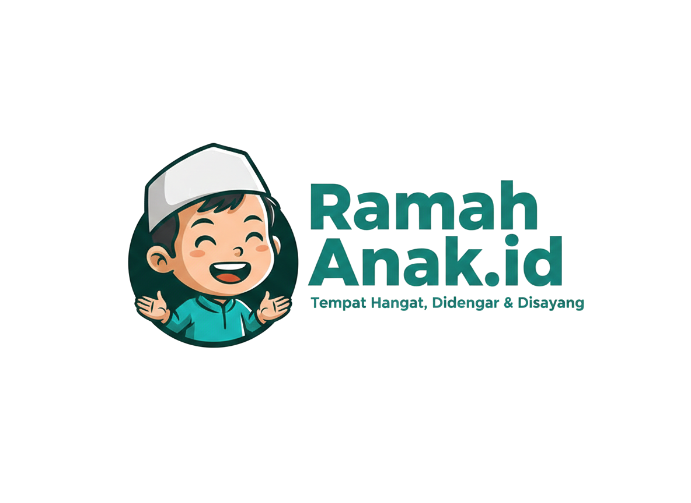

<div align="center">



# RamahAnak.id

### Platform Digital Sistem Manajemen Cerdas
### Pembinaan Adaptif & Dukungan Kesehatan Mental Santri

[](https://laravel.com)
[](https://reactjs.org)
[](https://python.org)
[](https://tailwindcss.com)
[](LICENSE)

[](.)
[](.)
[](.)
[](.)

---

> **Tugas Akhir** · Teknik Informatika · Universitas Muhammadiyah Sidoarjo  
> Muhammad Nur Rifqi Baharis · 2026

</div>

---

## 📋 Daftar Isi

- [Tentang Sistem](#-tentang-sistem)
- [Fitur Utama](#-fitur-utama)
- [Arsitektur Sistem](#-arsitektur-sistem)
- [Stack Teknologi](#-stack-teknologi)
- [Hasil Pengujian](#-hasil-pengujian)
- [Instalasi](#-instalasi)
- [Konfigurasi](#-konfigurasi)
- [Deployment](#-deployment)
- [Tim Pengembang](#-tim-pengembang)

---

## 🎯 Tentang Sistem

**RamahAnak.id** adalah platform digital berbasis **Rule-Based Expert System** yang dirancang khusus untuk pondok pesantren. Sistem ini mengintegrasikan **Natural Language Processing (NLP)** dan mesin inferensi **Forward Chaining** untuk mendukung pembinaan santri secara adaptif, objektif, dan terukur.

### Permasalahan yang Diselesaikan

| ❌ Sebelum | ✅ Sesudah |
|------------|-----------|
| Pencatatan pelanggaran manual & rawan hilang | Digital, terstruktur, aman di cloud |
| Tidak ada deteksi dini kondisi mental santri | Forward Chaining otomatis setiap malam |
| Tidak ada sistem poin terintegrasi | Trigger konsekuensi & reward otomatis |
| Koordinasi antar pembina lambat | Approval berjenjang digital real-time |
| Laporan teks bebas sulit diproses | NLP pipeline 8 tahap otomatis |

---

## ✨ Fitur Utama

### 👨‍💼 Guru BK (Administrator)
```
✓ Dashboard real-time dengan badge notifikasi
✓ Validasi laporan + NLP preprocessing otomatis
✓ Expert System Point (konsekuensi & reward)
✓ Expert System Konselor (diagnosis Forward Chaining)
✓ Kelola 43 rule IF-THEN via UI tanpa coding
✓ Kelola 6 variabel basis pengetahuan (16P + 3A + 19G + 10K + 5R + 36DX)
✓ Monitoring komprehensif per santri
✓ Generate PDF rekam medis
✓ Upload artikel edukasi konseling
```

### 👩‍🏫 Tenaga Pendidik (Wali Kelas)
```
✓ Input laporan teks bebas (bahasa alami)
✓ Approval laporan sebagai wali kelas
✓ Pantau santri kelas yang diampu
✓ Lihat jadwal bimbingan berkala
```

### 🎓 Santri
```
✓ Dashboard rekam jejak pribadi
✓ Upload bukti pelaksanaan konsekuensi
✓ Pantau status bimbingan konseling aktif
✓ Isi form bimbingan berkala
```

### ⚙️ Sistem & Otomasi
```
✓ NLP Pipeline 8 tahap (Case Folding → NER → Kode Matching → Negasi)
✓ Forward Chaining terjadwal setiap malam 23:00 WIB
✓ Trigger ES Point otomatis saat threshold terlampaui
✓ Approval berjenjang: TP → Wali Kelas → Guru BK
✓ Activity Logger middleware
✓ Halaman publik (Landing, Fitur, Artikel Konseling)
```

---

## 🏗️ Arsitektur Sistem

```
┌─────────────────────────────────────────────────────────┐
│                    CLIENT BROWSER                        │
│              React.js + Inertia.js + Tailwind            │
└──────────────────────────┬──────────────────────────────┘
                           │ HTTP/HTTPS
┌──────────────────────────▼──────────────────────────────┐
│                HOSTINGER SHARED HOSTING                  │
│                                                          │
│   ┌─────────────────┐    ┌──────────────────────────┐   │
│   │   Laravel 12    │    │      MariaDB / MySQL      │   │
│   │   PHP 8.2       │◄──►│      29 Tabel             │   │
│   │   (Backend)     │    │      db_ra                │   │
│   └────────┬────────┘    └──────────────────────────┘   │
│            │ HTTP POST (queue:sync)                       │
└────────────┼────────────────────────────────────────────┘
             │
┌────────────▼────────────────────────────────────────────┐
│               PYTHONANYWHERE (Flask API)                  │
│                                                          │
│   ┌─────────────────────────────────────────────────┐   │
│   │  NLP Pipeline                                    │   │
│   │  preprocessing.py → ner.py → kode_matching.py   │   │
│   │  Sastrawi Stemmer + Named Entity Recognition     │   │
│   └─────────────────────────────────────────────────┘   │
└─────────────────────────────────────────────────────────┘
```

### Alur NLP Pipeline

```
Input Teks Bebas
      │
      ▼
 1. Case Folding & Cleaning
      │
      ▼
 2. Tokenisasi
      │
      ▼
 3. Stopword Removal
      │
      ▼
 4. Stemming (Sastrawi)
      │
      ▼
 5. Named Entity Recognition v4
      │  (deteksi pelaku me- & korban di-)
      ▼
 6. Kode Matching
      │  (cocokkan dengan 1839 kata kamus)
      ▼
 7. Deteksi Negasi
      │  ("tidak telat" → apresiasi)
      ▼
 8. Output Terstruktur
      │
      ▼
 Laporan Kategori (P/A/G) + Pelaku + Korban
```

---

## 🛠️ Stack Teknologi

### Backend
| Teknologi | Versi | Fungsi |
|-----------|-------|--------|
| **Laravel** | `^12.0` | Framework PHP — routing, ORM, queue, scheduler |
| **PHP** | `^8.2` | Runtime server-side |
| **Laravel Sanctum** | `^4.0` | Autentikasi berbasis token |
| **DomPDF** | `^3.1` | Generate PDF rekam medis |
| **Inertia.js** | `^2.0` | Jembatan SPA Laravel ↔ React |
| **Ziggy** | `^2.0` | Expose named routes ke JavaScript |

### Frontend
| Teknologi | Versi | Fungsi |
|-----------|-------|--------|
| **React.js** | `^18.2` | Library UI komponen |
| **Vite** | `^7.0` | Build tool frontend |
| **Tailwind CSS** | `^3.2` | Utility-first CSS framework |
| **Headless UI** | `^2.0` | Komponen UI aksesibel |
| **Recharts** | `^3.7` | Chart & visualisasi data |
| **Heroicons** | `^2.2` | Icon library |

### NLP Engine
| Teknologi | Versi | Fungsi |
|-----------|-------|--------|
| **Python** | `3.9+` | Runtime NLP engine |
| **PySastrawi** | `1.2.0` | Stemmer Bahasa Indonesia |
| **Flask** | `3.0.3` | API wrapper NLP |
| **mysql-connector-python** | `9.1.0` | Koneksi database |

### Database & Infrastructure
| Teknologi | Keterangan |
|-----------|-----------|
| **MariaDB / MySQL** | 29 tabel relasional |
| **Hostinger Shared** | Hosting Laravel |
| **PythonAnywhere** | Hosting Flask NLP API |
| **GitHub Actions** | CI/CD auto-deploy |

---

## 📊 Hasil Pengujian

### Black Box Testing — 26 Skenario
```
┌─────────────────────────────────┬──────────┬───────────┐
│ Kategori                        │ Skenario │ Hasil     │
├─────────────────────────────────┼──────────┼───────────┤
│ Guru BK (Login, Laporan, ES)    │    14    │ ✅ 100%   │
│ Tenaga Pendidik (Laporan, Appr) │     5    │ ✅ 100%   │
│ Expert System & Santri          │     7    │ ✅ 100%   │
├─────────────────────────────────┼──────────┼───────────┤
│ TOTAL                           │    26    │ ✅ 100%   │
└─────────────────────────────────┴──────────┴───────────┘
```

### Akurasi NLP Preprocessing — 8 Laporan
```
Teks: "zurah memukul adel"     → P001, G019 | Pelaku: Zurah | Korban: Adel  ✅
Teks: "zurah kabur pesantren"  → P010        | Pelaku: Zurah               ✅
Teks: "adel terlihat sedih"    → G003        | Entitas: Adel               ✅
Teks: "nasyuwa juara porprov"  → A002        | Pelaku: Nasyuwa             ✅
Teks: "nasyuwa sopan di kelas" → A001, A003  | Pelaku: Nasyuwa             ✅
Teks: "zurah korban bully"     → G010        | Korban: Zurah               ✅
                                                           Akurasi: 100% ✅
```

### Expert System
```
Forward Chaining : Rule RB-06 fired {P001, G010} → DX-B06 (Bully-Victim Cycle) ✅
ES Point K001    : Trigger saat poin 15 (threshold 10)                           ✅
ES Point R001    : Trigger saat poin 34 (threshold 30)                           ✅
Sesi Bimbingan   : 2 sesi konseling berhasil (progress 20% → 40% → selesai)     ✅
```

---

## 🚀 Instalasi

### Prasyarat
- PHP `^8.2` + Composer
- Node.js `18+` + NPM
- Python `3.9+` + pip
- MariaDB / MySQL `10.6+`

### Clone & Setup

```bash
# 1. Clone repository
git clone https://github.com/USERNAME/ramahanak.git
cd ramahanak

# 2. Install PHP dependencies
composer install

# 3. Install JavaScript dependencies
npm install

# 4. Setup environment
cp .env.example .env

# 5. Generate application key
php artisan key:generate

# 6. Jalankan migrasi & seeder
php artisan migrate --seed

# 7. Install Python NLP dependencies
cd python
pip install -r requirements.txt
cd ..

# 8. Build frontend
npm run build

# 9. Storage link
php artisan storage:link

# 10. Jalankan server
php artisan serve
```

---

## ⚙️ Konfigurasi

Salin `.env.example` ke `.env` dan sesuaikan:

```env
APP_NAME=AplikasiRamahAnak-BimbinganTerukur
APP_ENV=local
APP_URL=http://localhost:8000

# Database
DB_CONNECTION=mysql
DB_HOST=127.0.0.1
DB_DATABASE=db_ra
DB_USERNAME=root
DB_PASSWORD=

# Queue (gunakan 'database' untuk production)
QUEUE_CONNECTION=sync

# NLP API (isi jika pakai PythonAnywhere)
NLP_API_URL=https://USERNAME.pythonanywhere.com
NLP_API_TOKEN=your-secret-token
```

---

## 🌐 Deployment

### Scheduler (wajib untuk production)
```bash
# Tambahkan ke crontab
* * * * * /usr/bin/php /path/to/artisan schedule:run >> /dev/null 2>&1
```

### Scheduled Jobs
| Command | Jadwal | Fungsi |
|---------|--------|--------|
| `konselor:check-triggers` | 23:00 WIB | Eksekusi 43 rule Forward Chaining |
| `expert-system:sync` | Setiap jam | Cek threshold poin santri |
| `laporan:sync-approvals` | 01:00 WIB | Sinkronisasi approval kelas |

### GitHub Actions CI/CD
Push ke `main` → otomatis deploy ke server via SSH.

```yaml
# .github/workflows/deploy.yml
on:
  push:
    branches: [main]
```

---

## 👨‍💻 Tim Pengembang

| Nama | Peran |
|------|-------|
| **Muhammad Nur Rifqi Baharis** | Developer / Peneliti |
| **Ika Ratna Indra Astutik, S.Kom.** | Pembimbing I |
| **Ade Eviyanti, S.Kom., M.Kom.** | Pembimbing II |
| **Novia Ariyanti** | Penguji |

---

## 📍 Institusi

**Teknik Informatika**  
Universitas Muhammadiyah Sidoarjo  
Jl. Mojopahit No. 666 B, Sidoarjo, Jawa Timur

---

<div align="center">

**© 2026 RamahAnak.id · Pondok Pesantren Muhammadiyah An-Nur Sidoarjo**

*Built with ❤️ for santri welfare*

</div>